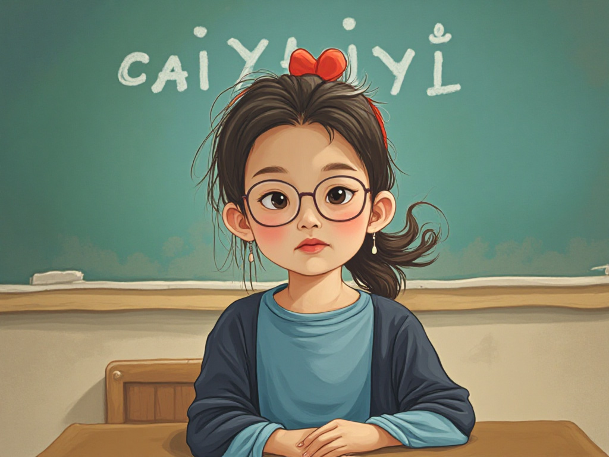

## 关于我

&emsp;&emsp; 大家好，我是蔡伊一 Yilia. 这是我的个人博客，我已经上三年级了。让我给大家介绍一下自己吧。

## 我爱吃

&emsp;&emsp; 我喜欢吃的食物是: 🍜 🍱 🍣 🍔 🍟 🍕 🍲 🍗 ...

## 好伙伴

&emsp;&emsp; 我的宠物是一只可爱的白色🐶八哥犬，名字叫做小白。它全身都是白的，只有嘴巴是黑色的。它喜欢和我玩捉迷藏，无论我藏在门后，床后，桌子后，椅子后，它都能找到我。小白有很多的优点，但也有个缺点，就是“护食”，当他吃饭时，我从它身旁走过，它就冲我呲牙，好像在说：“一边去，不要抢我的饭！”看起来可凶了。

## 我喜欢

&emsp;&emsp; 我现在喜欢看的书和爱看的电视都和《三国演义》有关。我最喜欢的人物是“诸葛亮”，字“孔明”，又被称为”卧龙“。我觉得他最神奇的时候是“诸葛祭风”。我一直想知道诸葛亮是怎么祭到风的，这也太厉害了！

